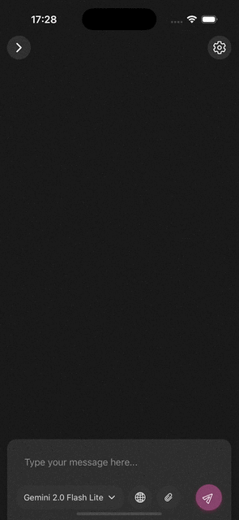
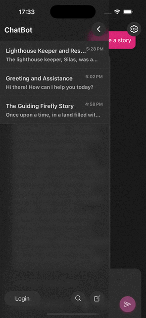
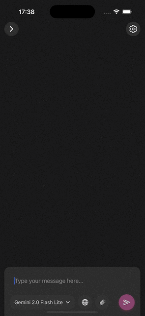
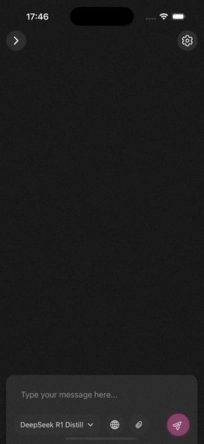

# AI Chatbot

A mobile AI chat application built with Expo using OpenRouter, inspired by the design of [t3.chat](https://t3.chat).

## Features

- **Real-time Response Streaming** - Watch AI responses appear in real-time
- **Persistent Chat History** - Never lose your important conversations
- **Image Upload Support** - Share images directly in your chats
- **Multiple AI Models** - Choose the right model for your needs

## Demo

Here's what you can do with the app:

| Response Streaming                                       | Chat History                                 | Image Upload                                 | Multiple Models                                    |
| -------------------------------------------------------- | -------------------------------------------- | -------------------------------------------- | -------------------------------------------------- |
|  |  |  |  |

## 🚧 Work in Progress

Features that are coming soon:

- Zustand for Global States
- Custom Live Markdown Renderer (Currently only renders markdown after response is finished)
- Syntax Highlighting
- Authentication (Maybe)
- Settings
- Themes
- Web Search Integration
- App Icon
- Splash Screen
- Image Generation (Maybe)

## 🚀 Getting Started

1. Install the dependencies:

   ```bash
   npm install
   ```

2. Create a .env file in the root directory and add your OpenRouter API key:
   ```bash
   OPENROUTER_API_KEY=your_api_key_here
   ```
3. Start the app:
   ```bash
   npx expo start
   ```
4. Open in IOS-Simulator (Requires Mac and X-Code):
   ```bash
   i
   ```

The project uses [file-based routing](https://docs.expo.dev/router/introduction).

## 💡 Acknowledgments

- Design inspired by [t3.chat](https://t3.chat)
